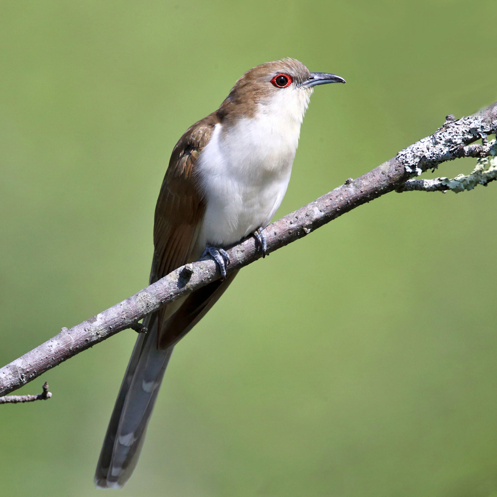

```{r setup, include=FALSE}
knitr::opts_chunk$set(echo = FALSE, message=FALSE, warning=FALSE)
```


# Identifying Emerging Patterns in Yearly Breeding Bird Surveys Conducted at the MSUM Regional Science Center

MaryJo Nelson, Dr. Chris Merkord

Biosciences Department, Minnesota State University Moorhead, 1104 7th Avenue South, Moorhead, MN 56563 USA



Black-billed Cuckoo

*Photo: Tom Murray/Flickr (CC BY NC 2.0)*

## Abstract

Long-term studies of the presence and distribution of species within an ecosystem can provide an understanding of the health of that ecosystem over time, thus aiding researchers in assessing the necessity of conservation efforts for those species, and in determining the efficacy of previously implemented conservation efforts. For the past three years, students in the Geospatial Ecology Lab have been conducting breeding bird surveys at the MSUM Regional Science Center, and my goal is to conduct an exploratory data analysis to determine if any patterns have begun to emerge by looking at broad population movement in space and time, as well as patterns in behavior and habitat selection within individual species. Specifically, I will look at the distribution of the Black-billed Cuckoo and assess what environmental variables might affect its habitat selection, as this pertains directly to research that I will be conducting this summer. With only three years of data, it might be too soon to make any significant assumptions about longitudinal changes in populations, however I am hoping to get a good idea of the distribution of various species with regard to location, habitat, and the time of day/year they are most likely to be observed. Having this information will provide the basis for asking more specific research questions in the future, and beginning a broad analysis at this stage in the project can make it easier to make comparisons to future data about the state of the ecosystem at the Regional Science Center.

## Introduction

### Longitudinal Breeding Bird Surveys:


Map of survey points within Orange, Blue, Purple, and Yellow transects.

### Black-billed Cuckoos:

## Methods

### Data Acquisition

I am using data collected from longitudinal bird surveys conducted at the MSUM Regional Science Center in 2018 and 2019 by the Geospatial Ecology Lab in the Biosciences Department of MSUM. I exported the data from a Microsoft Access database into Excel, and then read the Excel sheets into RStudio using the (readxl) package (RStudio Team 2021, Wickham et al 2019).

```{r load packages}
library(tidyverse)
library(readxl)
library(lubridate)
library(sf)
library(cowplot)
library(googleway)
library(ggrepel)
library(ggspatial)
library(rnaturalearth)
library(rnaturalearthdata)
library(rgeos)
library(sp)
library(suncalc)
library(ggpubr)
```

```{r read in data}
# Observations
ob <- read_excel("Bird Survey Data/observations.xlsx") %>%
   select(-dttm_created)
ob_sna <- read_excel("Bird Survey Data/observations_sna.xlsx")

# Surveys
sur <- read_excel("Bird Survey Data/surveys.xlsx") %>%
   filter(!is_shadow) %>%
   select(-dttm_created) %>%
   mutate(
     survey_date = date(survey_date),
     # survey_dttm = paste(
     #   as.character(survey_date),
     #   as.character(survey_time) %>% 
     #     str_sub(12, 19)
     # ) %>% 
     #   as_datetime(),
     survey_mss = hour(survey_time)*60 + minute(survey_time) - 330
     )

# Point Data
pts <- read_excel("Bird Survey Data/points.xlsx") %>%
   select(-dttm_created)
pc <- read_excel("Bird Survey Data/point_coverage.xlsx") %>%
    select(-transect_name, -point_num)

# Observer Data
observer <- read_excel("Bird Survey Data/observers.xlsx") %>%
   select(-dttm_created)

# Species Data
sp <- read_excel("Bird Survey Data/species.xlsx")

```

### Data Preparation

The data collected was spread amongst several tables, with the variables I was hoping to compare all being in different locations. Therefore, the next step I took was to join the desired tables using the left_join function in (dplyr). I then used the select function in (dplyr) so the table would show only the variables I wanted to look at, including point ID, species observed, survey date and time, observer, and landscape and environmental factors (Wickham et al 2020). This gave me one large, clean table for all the data collected. For the survey time, I used the mutate function in (dplyr), the hour and minute functions in (lubridate), as well as some basic math functions in base R to convert the time that each survey was recorded into minutes passed since sunrise (Wickham et al 2020; Grolemund 2011; R Core Team 2020). Finally, using this table and the base R filter function, I created several smaller tables that only contained information for each individual year, transect, and specific species, such as the Black-Billed Cuckoo (R Core Team 2020).

```{r Joint Tables}
d <-
  sur %>% 
  left_join(pts, by = "point_id") %>%
  left_join(pc, by = "point_id") %>% 
  left_join(ob, by = "survey_id") %>% 
  left_join(observer, by = "observer_id") %>% 
  left_join(sp, by = "species_id") %>%
  pivot_longer(cols = c(n_0_50, n_50_100, n_100_), names_to="distance", values_to="n_indiv") %>%
  filter(!is.na(n_indiv)) %>%
  uncount(weights = n_indiv)

d <- select(d, point_id, transect_name, PRIMARY_COM_NAME, survey_date, survey_mss,distance, observation_notes, data_entry_notes,
             observer_name, herbaceous, shrub, forest, river, bare, wind_speed_mean, temp, cloud_cov) %>%
    mutate(point_id = as_factor(point_id))
```

```{r filter out unknown sp}
# Filter out unknown bird species, count -----------------------------------------
abc <- filter(d, !(PRIMARY_COM_NAME == "bird sp."), !(PRIMARY_COM_NAME == "NA"))
species <- count(abc, PRIMARY_COM_NAME)
```

```{r filter by year, count}
# Filter by year, count ----------------------------------------------------------
nineteen <- filter(abc, str_detect(survey_date, "2019-"))
n_sp_cnt <- count(nineteen, PRIMARY_COM_NAME)

eighteen <- filter(abc, str_detect(survey_date, "2018-"))
e_sp_cnt <- count(eighteen, PRIMARY_COM_NAME)

abc_c <- filter(abc, observer_name == "Chris")
```

```{r filter black-billed cuckoo}
# Filter Black-billed Cuckoo ------------------------------------------------

bbc <- filter(abc, PRIMARY_COM_NAME == "Black-billed Cuckoo") 

bbc_pts <- count(bbc, point_id)

bbc_19 <- filter(bbc, str_detect(survey_date, "2019-"))
bbc_18 <- filter(bbc, str_detect(survey_date, "2018-"))


# BBC observer count

bbc_o <- count(bbc, observer_name)
```

### Data Analysis

The first thing I did in my analysis of the data was to make a series of graphs using many functions in (ggplot2) to compare various variables to each other in order to determine if any patterns were beginning to emerge (Wickham 2016). One of the things I wanted to look at was when surveyors were most likely to observe birds, both with with regard to time of day and time of year, so I created several histograms using geom_histogram in (ggplot2) to visualize the number of observances that were occurring, regardless of species, at each time of day and year. I did this for all years combines, broken down by year, and also filtered for the Black-billed Cuckoo species. My second goal was to see if any patterns could be seen with regard to the types of landscape variables present where Black-billed Cuckoos had been observed. Prior to the very first survey, students had looked at aerial imagery of each point to estimate what percentage of the landscape in each area was herbaceous, shrub, forest, river, and bare. I used their estimations and, using the geom_bar function in (ggplot2), I compared how many Black-billed Cuckoo observations had occurred at points with varying percentages of each landscape variable.

## Results

### When is the best time of summer to see breeding birds?

#### Number of Individual Bird Observations Per Week

Dates with most observations inconsistent from year to year

```{r histograms, date vs. observation count}
#2019
d_19 <- ggplot(data = nineteen) +
  geom_histogram(mapping = aes(x = survey_date), binwidth = 7, color = "black", fill = "#EE9A4D") +
  labs(x = "Survey Date", y = "Number of Observations", 
       title = "2019") 

#2018
d_18 <- ggplot(data = eighteen) +
  geom_histogram(mapping = aes(x = survey_date), binwidth = 7, color = "black", fill = "#EAC117")+
  labs(x = "Survey Date", y = "Number of Observations", 
       title = "2018")

#combine

ggarrange(d_19, d_18,ncol = 2, nrow = 1)
```

### When is the best time of day to see breeding birds?

```{r time of observations, all}
ggplot(data = d) +
  geom_vline(xintercept = 240, linetype = "dashed", size = 1, color = "red") +
  geom_histogram(mapping = aes(x = survey_mss),fill = "#92C7C7", 
                 color = "black", binwidth = 30, alpha = .5
                 ) +
  annotate(geom = "text", x = 250, y = 1000, hjust = 0, 
           label = "Cutoff time for surveys:\n4 hours (240 minutes)\nafter sunrise") +
  labs(x = "Minutes after Sunrise", y = "Number of Observations", 
       title = "Most bird detections occur within 4 hours of sunrise") + 
  theme_classic()
```

Time of observations ***is*** consistent from year to year.

```{r time filtered by year}
t_19 <- ggplot(data = nineteen) +
  geom_vline(xintercept = 240, linetype = "dashed", size = 1, color = "red") +
  geom_histogram(mapping = aes(x = survey_mss),fill = "#5E5A80", 
                 color = "black", binwidth = 30, alpha = .5) +
  labs(x = "Minutes after Sunrise", y = "Number of Observations", 
       title = "Time of Observations 2019") + 
  theme_classic()

t_18 <- ggplot(data = eighteen) +
  geom_vline(xintercept = 240, linetype = "dashed", size = 1, color = "red") +
  geom_histogram(mapping = aes(x = survey_mss),fill = "#4B0082", 
                 color = "black", binwidth = 30, alpha = .5) +
  labs(x = "Minutes after Sunrise", y = "Number of Observations", 
       title = "Time of observations 2018") + 
  theme_classic()

ggarrange(t_19, t_18, ncol = 2, nrow = 1)

```

Black-billed Cuckoos appear to be observed later in the day.

```{r bbc time}
ggplot(data = bbc) +
  geom_vline(xintercept = 240, linetype = "dashed", size = 1, color = "red") +
  geom_histogram(mapping = aes(x = survey_mss),fill = "#728C00", 
                 color = "black", binwidth = 70, alpha = .5) +
  labs(x = "Minutes after Sunrise", y = "Number of Observations", 
       title = "Time of Black-billed Cuckoo Observations") + 
  theme_classic()
```

### What landscape variables correlate with where Black-billed Cuckoos are found?

```{r bbc landscape factors}
# BAR GRAPHS, environmental factors ---------------------------------------

#herbaceous
herb <- ggplot(data = bbc) +
  geom_bar(mapping = aes(x = herbaceous), color = "black", fill = "#FF7F50") +
  scale_x_continuous(breaks = seq(0, 100, 10), limits = c(0, 100)) +
  scale_y_continuous(breaks = seq(0, 6, 1), limits = c(0, 6)) +
  labs(x = "Percent of landscape that is Herbaceous", 
       y = "Observations", title = "Herbaceous (15/18 observations)") +
  theme_classic() +
  theme(
    plot.title = element_text(face = "bold")
  )

#shrub
shrub <- ggplot(data = bbc) +
  geom_bar(mapping = aes(x = shrub), color = "black", fill = "#6AA121") +
  scale_x_continuous(breaks = seq(0, 100, 10), limits = c(0, 100)) +
  scale_y_continuous(breaks = seq(0, 6, 1), limits = c(0, 6)) +
  labs(x = "Percent of landscape that is Shrub", 
       y = "Observations", title = "Shrub (11/18 observations)") +
  theme_classic() +
  theme(
    plot.title = element_text(face = "bold")
  )

#forest
forest <- ggplot(data = bbc) +
  geom_bar(mapping = aes(x = forest), color = "black", fill = "#347235") +
  scale_x_continuous(breaks = seq(0, 100, 10), limits = c(0, 100)) +
  scale_y_continuous(breaks = seq(0, 6, 1), limits = c(0, 6)) +
  labs(x = "Percent of landscape that is Forest", 
       y = "Observations", title = "Forest (5/18 observations)") +
  theme_classic() +
  theme(
    plot.title = element_text(face = "bold")
  )

#river
river <- ggplot(data = bbc) +
  geom_bar(mapping = aes(x = river), color = "black", fill = "#43BFC7") +
  scale_x_continuous(breaks = seq(0, 100, 10), limits = c(0, 100)) +
  scale_y_continuous(breaks = seq(0, 6, 1), limits = c(0, 6)) +
  labs(x = "Percent of landscape that is River", 
       y = "Observations", title = "River (5/18 observations)") +
  theme_classic() +
  theme(
    plot.title = element_text(face = "bold")
  )

#bare
bare <- ggplot(data = bbc) +
  geom_bar(mapping = aes(x = bare), color = "black", fill = "#AF9B60") +
  scale_x_continuous(breaks = seq(0, 100, 10), limits = c(0, 100)) +
  scale_y_continuous(breaks = seq(0, 6, 1), limits = c(0, 6)) +
  labs(x = "Percent of landscape that is Bare", 
       y = "Observations", title = "Bare (2/18 observations)") +
  theme_classic() +
  theme(
    plot.title = element_text(face = "bold")
  )

# combine graphs

(figure <- ggarrange(herb, shrub, forest, river, bare,
                    ncol = 2, nrow = 3))


```

## Discussion

### Time of Summer:

### Time of Day:

### Landscape Correlates for Black-billed Cuckoo Observations:

## References

-   Grolemund, Garrett and Hadley Wickham (2011). Dates and Times Made Easy with lubridate. Journal of Statistical
 Software, 40(3), 1-25. URL <https://www.jstatsoft.org/v40/i03/.>

-   R Core Team (2020). R: A language and environment for statistical computing. R Foundation for Statistical Computing, Vienna, Austria. URL <https://www.R-project.org/>.

-   RStudio Team (2021). RStudio: Integrated Development Environment for R. RStudio, PBC, Boston, MA URL <http://www.rstudio.com/>.

```{=html}
<!-- -->
```
-   Wickham, Hadley. ggplot2: Elegant Graphics for Data Analysis. Springer-Verlag New York, 2016.

```{=html}
<!-- -->
```
-   Wickham, Hadley and Jennifer Bryan (2019). readxl: Read Excel Files. R package version 1.3.1. <https://CRAN.R-project.org/package=readxl>

```{=html}
<!-- -->
```
-   Wickham, Hadley, Romain François, Lionel Henry and Kirill Müller (2020). dplyr: A Grammar of Data Manipulation. R package version 1.0.2. <https://CRAN.R-project.org/package=dplyr>

-   Wickham, Hadley (2021). tidyr: Tidy Messy Data. R package version 1.1.3.
 <https://CRAN.R-project.org/package=tidyr>
