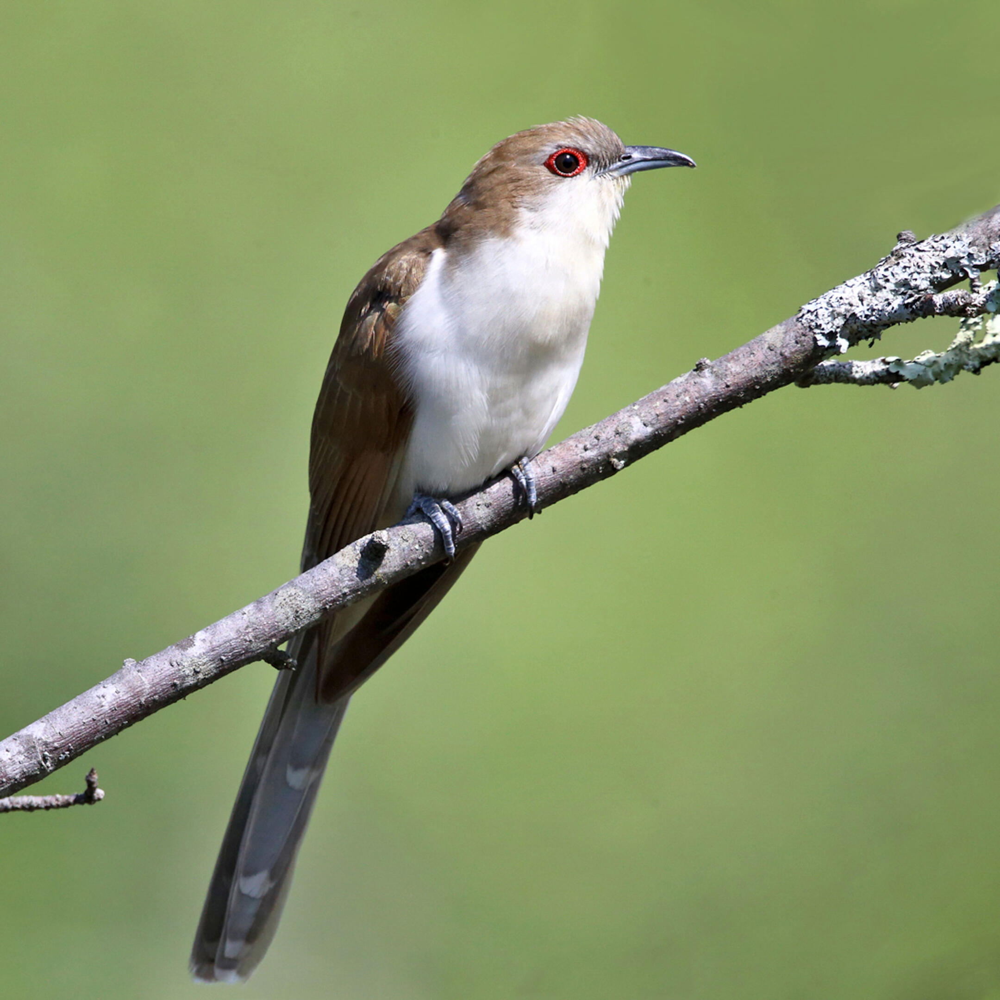

# Identifying Emerging Patterns in Yearly Breeding Bird Surveys Conducted at the MSUM Regional Science Center

MaryJo Nelson, Dr. Chris Merkord

Biosciences Department, Minnesota State University Moorhead, 1104 7th
Avenue South, Moorhead, MN 56563 USA

Black-billed Cuckoo

*Photo: Tom Murray/Flickr (CC BY NC 2.0)*

## Abstract

Long-term studies of the presence and distribution of species within an
ecosystem can provide an understanding of the health of that ecosystem
over time, thus aiding researchers in assessing the necessity of
conservation efforts for those species, and in determining the efficacy
of previously implemented conservation efforts. For the past three
years, students in the Geospatial Ecology Lab have been conducting
breeding bird surveys at the MSUM Regional Science Center, and my goal
is to conduct an exploratory data analysis to determine if any patterns
have begun to emerge by looking at broad population movement in space
and time, as well as patterns in behavior and habitat selection within
individual species. Specifically, I will look at the distribution of the
Black-billed Cuckoo and assess what environmental variables might affect
its habitat selection, as this pertains directly to research that I will
be conducting this summer. With only three years of data, it might be
too soon to make any significant assumptions about longitudinal changes
in populations, however I am hoping to get a good idea of the
distribution of various species with regard to location, habitat, and
the time of day/year they are most likely to be observed. Having this
information will provide the basis for asking more specific research
questions in the future, and beginning a broad analysis at this stage in
the project can make it easier to make comparisons to future data about
the state of the ecosystem at the Regional Science Center.

## Introduction

### Longitudinal Breeding Bird Surveys:

Students from the Geospatial Ecology Lab (GEL) have been conducting
summer breeding bird surveys at the MSUM Regional Science Center since
2018, typically between the months of mid-May to mid-July. There are
three transects (titled orange, blue, and purple) consisting of eleven
points each at the Regional Science Center, and in the summer of 2018 an
additional transect (yellow) was surveyed at the nearby Bluestem Prairie
Scientific and Natural Area. Each day, all of the points from one
transect were surveyed, starting at or just before sunrise and
continuing through mid to late morning. Ten minutes were spent at each
point, during which time the survey technicians would count and record
every individual bird they saw and what species it was. Additional
variables recorded included the time of the observation, weather
conditions, whether the observation was auditory or visual, and the
distance at which the bird was seen, among others. I was only able to
retrieve data from the first two years of the surveys, 2018 and 2019,
which is reflected in my exploratory analysis.

Below is a map of all of the survey points, with each color representing
a transect.

### Black-billed Cuckoos:

Black-billed Cuckoos breed throughout the upper Midwest and the
northeastern United States and migrate to South America during the
non-breeding season. They are insectivorous and often prey on
caterpillars and cicadas during outbreaks. The species is assigned a
Continental Concern Score of 13/20 by Partners in Flight and designated
a Yellow Watch List species in addition to being listed as a Species in
Greatest Conservation Need by the Minnesota Department of Natural
Resources, and as a Minnesota Stewardship Species by Audubon Minnesota
(Pfannmuller et al. 2009-2013).

The relationship between Black-billed Cuckoo abundance and habitat
characteristics is poorly studied. In the upper Midwest, Black-billed
Cuckoo abundance has been found to have a positive relationship with
forest cover (Thogmartin and Knutson 2007). In western Minnesota,
however, they appear to be most common in areas of thick shrub thickets
in grasslands, with little regard to proximity to forest (Chris Merkord,
personal observations). This brings up the possibility that the factors
driving habitat use in the eastern, forested part of their range are
different than the factors driving habitat use in the grasslands, as has
been suggested by others (Eastman 1991).

## Methods

### Data Acquisition

I am using data collected from longitudinal bird surveys conducted at
the MSUM Regional Science Center in 2018 and 2019 by the Geospatial
Ecology Lab in the Biosciences Department of MSUM. I exported the data
from a Microsoft Access database into Excel, and then read the Excel
sheets into RStudio using the (readxl) package (RStudio Team 2021,
Wickham et al 2019).

### Data Preparation

The data collected was spread amongst several tables, with the variables
I was hoping to compare all being in different locations. Therefore, the
next step I took was to join the desired tables using the left\_join
function in (dplyr). I then used the select function in (dplyr) so the
table would show only the variables I wanted to look at, including point
ID, species observed, survey date and time, observer, and landscape and
environmental factors (Wickham et al 2020). This gave me one large,
clean table for all the data collected. For the survey time, I used the
mutate function in (dplyr), the hour and minute functions in
(lubridate), as well as some basic math functions in base R to convert
the time that each survey was recorded into minutes passed since sunrise
(Wickham et al 2020; Grolemund 2011; R Core Team 2020). Finally, using
this table and the base R filter function, I created several smaller
tables that only contained information for each individual year,
transect, and specific species, such as the Black-Billed Cuckoo (R Core
Team 2020).

### Data Analysis

The first thing I did in my analysis of the data was to make a series of
graphs using many functions in (ggplot2) to compare various variables to
each other in order to determine if any patterns were beginning to
emerge (Wickham 2016). One of the things I wanted to look at was when
surveyors were most likely to observe birds, both with with regard to
time of day and time of year, so I created several histograms using
geom\_histogram in (ggplot2) to visualize the number of observances that
were occurring, regardless of species, at each time of day and year. I
did this for all years combines, broken down by year, and also filtered
for the Black-billed Cuckoo species. My second goal was to see if any
patterns could be seen with regard to the types of landscape variables
present where Black-billed Cuckoos had been observed. Prior to the very
first survey, students had looked at aerial imagery of each point to
estimate what percentage of the landscape in each area was herbaceous,
shrub, forest, river, and bare. I used their estimations and, using the
geom\_bar function in (ggplot2), I compared how many Black-billed Cuckoo
observations had occurred at points with varying percentages of each
landscape variable.

## Results

### When is the best time of summer to see breeding birds?

#### Number of Individual Bird Observations Per Week

Dates with most observations are inconsistent from year to year

<!-- -->

### When is the best time of day to see breeding birds?

<!-- -->

Time of observations ***is*** consistent from year to year.

<!-- -->

<!-- -->

### What landscape variables correlate with where Black-billed Cuckoos are found?

<!-- -->

## Discussion

### Time of Summer:

-   Data from the two different years varies

-   Not enough data at this point to know when is the best time of
    summer to see breeding birds

### Time of Day:

-   Data clearly shows that most observations occurred within 4 hours
    after sunrise

    -   Consistent from year to year

    -   Is this true for individual species as well?

-   This can inform future summer bird surveys

    -   Should we aim to be finished with our survey by 4 hours after
        sunrise?

    -   There seems to be little advantage in continuing after this time

-   Black-billed Cuckoo falls within this time frame, but seems to peak
    later in day than total population

    -   Keep in mind extremely small sample size (18)

    -   Will this pattern continue as we collect more data?

### Landscape Correlates for Black-billed Cuckoo Observations:

-   Black-billed Cuckoos are correlated with forest landscapes, our data
    contradicts this

    -   83% of observations occurred where there was at least some
        herbaceous landcape

        -   56% occurred with at least 50% herbaceous landscape

    -   27% occurred where at least some forest landscape

        -   11% occurred with at least 50% forest landscape

-   Why do they choose herbaceous landscape here?

    -   What benefits is the herbaceous landscape providing in this
        area?

-   We must take into account the very small sample size

    -   is it small because there aren’t many here or because of
        unskilled observers?

    -   if because there aren’t many there, is that because there isn’t
        much forest here?

        -   We could look into what percentage of our survey area
            consists of forest landscape

    -   Will this pattern of herbaceous landscape continue as we collect
        more data?

## References

-   Eastman J. 1991. “Black-billed Cuckoo.” In The atlas of breeding
    birds of Michigan., edited by R. Brewer, G. A. McPeek and Jr R. J.
    Adams, 232-233. East Lansing: Michigan State Univ. Press.

-   Grolemund, Garrett and Hadley Wickham (2011). Dates and Times Made
    Easy with lubridate. Journal of Statistical Software, 40(3), 1-25.
    URL <https://www.jstatsoft.org/v40/i03/.>

-   Pfannmuller L, Niemi G, Green J, Sample B, Walton N, Zlonis E, Brown
    T, Bracey A, Host G, Reed J, Rewinkel K, Will N. 2017. The First
    Minnesota Breeding Bird Atlas (2009-2013).
    <https://mnbirdatlas.org/>

-   R Core Team (2020). R: A language and environment for statistical
    computing. R Foundation for Statistical Computing, Vienna, Austria.
    URL <https://www.R-project.org/>.

-   RStudio Team (2021). RStudio: Integrated Development Environment
    for R. RStudio, PBC, Boston, MA URL <http://www.rstudio.com/>.

-   Thogmartin WE, Knutson MG. 2007. Scaling local species-habitat
    relations to the larger landscape with a hierarchical spatial count
    model. Landscape Ecology 22:61-75.

<!-- -->

-   Wickham, Hadley. ggplot2: Elegant Graphics for Data Analysis.
    Springer-Verlag New York, 2016.

<!-- -->

-   Wickham, Hadley and Jennifer Bryan (2019). readxl: Read Excel Files.
    R package version 1.3.1. <https://CRAN.R-project.org/package=readxl>

<!-- -->

-   Wickham, Hadley, Romain François, Lionel Henry and Kirill Müller
    (2020). dplyr: A Grammar of Data Manipulation. R package version
    1.0.2. <https://CRAN.R-project.org/package=dplyr>

-   Wickham, Hadley (2021). tidyr: Tidy Messy Data. R package version
    1.1.3. <https://CRAN.R-project.org/package=tidyr>
